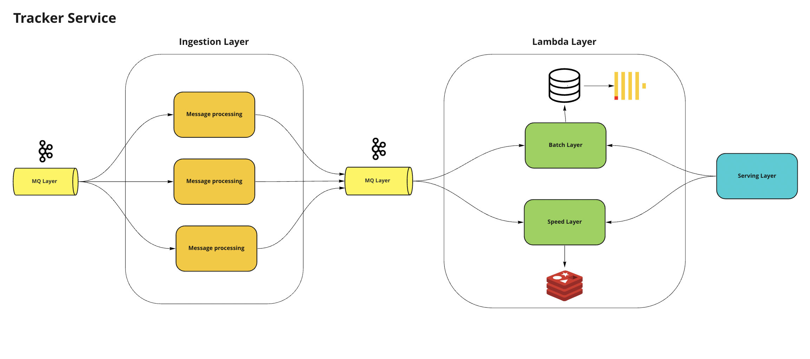

# Lambda Architecture with NodeJS



It's a simple implementation of methodology what I've read in https://www.amazon.com/Data-Lake-Enterprises-Architecture-enterprise/dp/1787281345

### About:
- This project is received user hits from API (also I made a project(**HitGenerator**) to generate events).
- The events go to the **Kafka** and then, on the ingestion layer (**HitConsumer**) redirect to the two services (**HitConsumerSpeed** and **HitConsumerBatch**).
- On the speed layer, aggregates of counting are stored in the redis.
- On the batch layer hits store to the clickhouse through clickhouse-bulk adapter to avoid extra inserts, also this layer simulates a long SQL operation and then updates and enrich aggregates in the speed layer.
- On the service layer, we use express.

All component parts are dynamically managed using Docker.

### Stack:
- TypeScript
- NodeJS
- Redis
- Clickhouse
- Clickhouse-bulk
- Zookeeper
- Kafka
- Docker

### How to use:
- Install docker && docker-compose
- docker-compose up
- Send a hit request using curl:
```curl
curl --location --request GET 'http://127.0.0.1:6000/hit?url=http://google.ru' \
  --data-raw ''
```
- Send a stats request by day using curl:
```curl
 curl --location --request GET 'http://127.0.0.1:6000/stats?date=2022-09-07' \
  --data-raw ''
```
